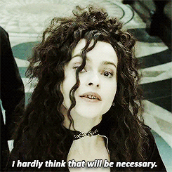

  

  

  <i>Available for any project · Available now for mobile</i>

 

---

<table>
<tr>
<td>

## <code>01</code> — About

**Who I am**  
I'm **Andassa** — a Fullstack and mobile developer who **ships**. I don't just write code; I turn ideas into products. Web apps, mobile apps, APIs, dashboards, automation, or AI-powered tools — I build them with you, end to end. From Flutter to Next.js, Express to FastAPI, MongoDB to PostgreSQL, Docker to AWS, I cover the full stack so you can focus on *what* to build, not *how*.

**Why work with me**  
I learn fast and adapt faster. New language? New framework? Tight deadline? I get up to speed and deliver. I've proven it on HackerRank and CodinGame, and I bring the same drive to real projects: clean code, clear communication, and a focus on **shipping**. I'm not here to take a brief and disappear — I'm here to make your product happen and your users happy.

**Right now**  
I'm **available for any project** and **available right now for mobile work**. If you have an idea, a problem to solve, or a product to build — let's talk. No fluff, no delay. Let's build something people actually use.

 

  
  &nbsp;
  

</td>
<td align="center" width="320">

<b>👋 That's me</b>

</td>
</tr>
</table>

---

 

## <code>02</code> — Status

  
  &nbsp;&nbsp;
  

 

---

## <code>03</code> — Skills

<table>
<tr>
<td width="33%" valign="top">

#### Languages

#### Frontend & Mobile

</td>
<td width="33%" valign="top">

#### Backend & Data

#### DevOps & Infra

</td>
<td width="34%" valign="top">

#### Tools & Design

#### & more
`RAG` · `Web Scraping` · `N8N` · `Unreal Engine` · `Blueprint` · `E2E`

</td>
</tr>
</table>

 

---

## <code>04</code> — Connect

<table>
<tr>
<td align="center" width="50%">

**Professional**

</td>
<td align="center" width="50%">

**Socials**

</td>
</tr>
</table>

 

---

## <code>05</code> — GitHub

<table>
<tr>
<td align="center" width="50%">

**Stats**

</td>
<td align="center" width="50%">

**Top languages**

</td>
</tr>
<tr>
<td colspan="2" align="center">

**Streak**

</td>
</tr>
<tr>
<td colspan="2" align="center">

**Top contributed repos**

</td>
</tr>
</table>

 

---

## <code>06</code> — Let's build something

> **🟢 Available for any project**  
> **📱 Available right now for mobile**

 

 

*Have an idea? Let's talk — no fluff, no delay.* 🔥

 

---

  
  &nbsp;&nbsp;
  

